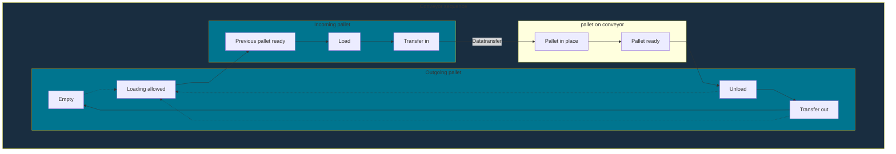

# Conveyor flowchart

```mermaid
flowchart TB
linkStyle default interpolate linear

style main fill:#192D40
style loading fill:#00758f
style unloading fill:#00758f


subgraph main [Conveyor sequence]
subgraph subgraph_padding [ ]
    style subgraph_padding fill:none
    style subgraph_padding stroke:none
    direction LR

        subgraph loading [Incoming pallet]

            %% nodes
            Prev[Previous pallet ready]
            Load
            T/I[Transfer in]

            %% links
            Prev --> Load --> T/I
        end

        subgraph place [pallet on conveyor]
            Ready[Pallet ready]
            Place[Pallet in place]
            Place --> Ready
        end

        subgraph unloading [Outgoing pallet]

            %% nodes
            Empty
            Unload
            T/O[Transfer out]
            allow[Loading allowed]

            %% links

            Unload --> T/O --> Empty
            Unload & T/O & Empty -.-> allow
        end
    end
end
%% Links
T/I -- Datatransfer --> Place
Ready --> Unload
allow --> Prev

```
