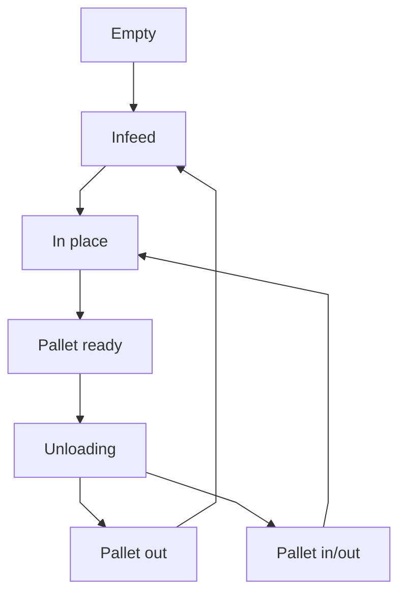

# Conveyor flowchart

```mermaid
graph TD;
linkStyle default interpolate linear

%% Nodes
    E[Empty]
    I[Infeed]
    P[In place]
    R[Pallet ready]
    U[Unloading]
    I/O[Pallet in/out]
    O[Pallet out]

%% Links
    E-->I
    I-->P
    P-->R
    R-->U
    U-->O;
    U-->I/O
    I/O-->P
    O-->I

```
